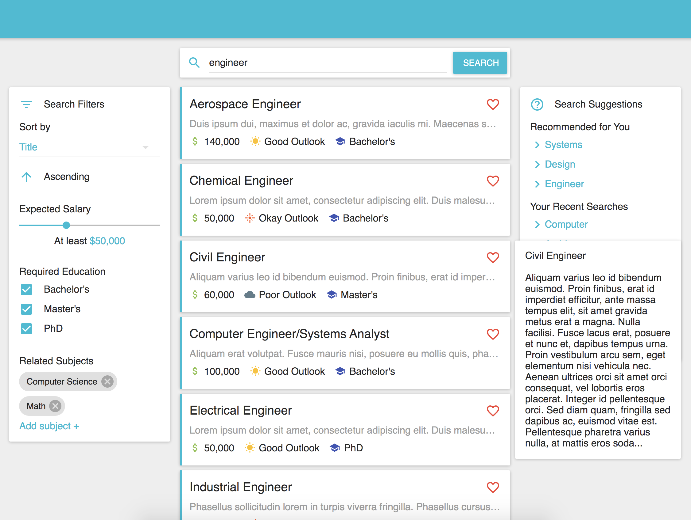

# Eureka

Eureka is an app that guides high school students on their journey towards their ideal careers. Currently, it's just a proof of concept, but the application features are shown below.

The Home Page suggests articles about different career paths that the student can take, and shows personalized recommendations based on what kind of careers the student has looked at in the past:

The student can use the Search Page to find other careers that they might be interested in. The Search Page allows the student to tune the various search criteria and preview each Career Info Page before they commit to jumping in:

When the student navigates to a Career Info Page, they can see the outlook of the career as well as how much the career aligns with their interests:

Within a Career Info Page, the app recommends relevant videos and postsecondary institutions that the student might consider when pursuing their desired career:

Finally, the student can use all of this information to create a roadmap towards their ideal career in order to stay on track:

